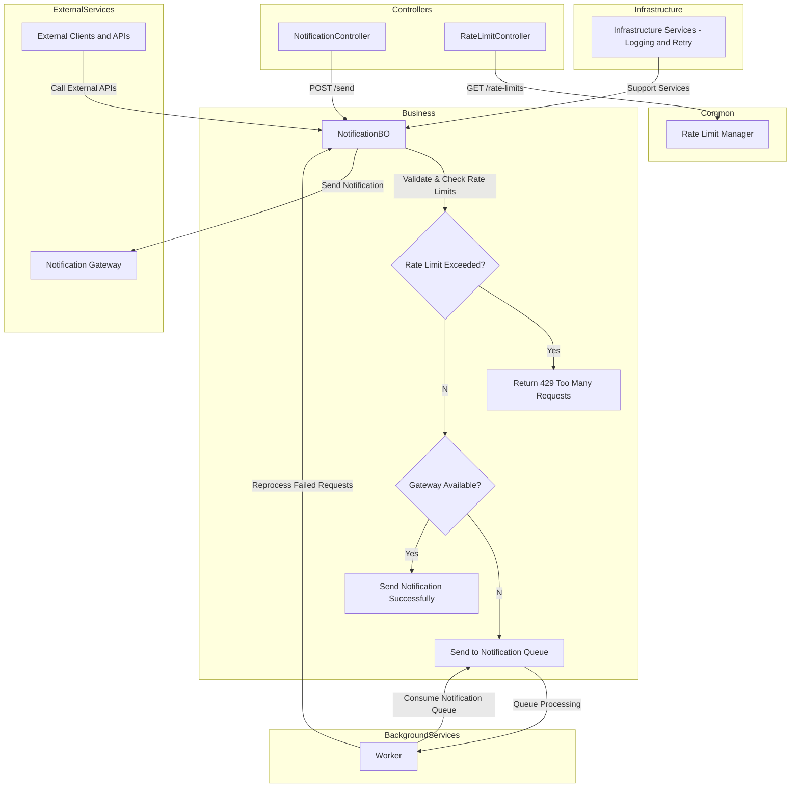

# 🚨 **Notification System - Rate-Limited Notification Service**

> A service that sends notifications with rate-limiting based on different notification types (Status, News, Marketing) to prevent excessive notifications to users.

---

## 📝 **Description**

This project is a notification service with rate-limiting functionality. It sends notifications to users based on different types (such as Status, News, Marketing) and enforces limits to ensure users are not overwhelmed with too many notifications in a short period.

The system checks if the number of notifications sent exceeds the defined limit for each message type and rejects new notifications when the limit is reached. It also provides a retry mechanism to ensure notifications are sent whenever possible.

---

## 🛠️ **Tech Stack**

- **.NET 7.0**: Core framework used.
- **FluentAssertions**: For streamlined unit testing and assertions.
- **Moq**: For creating mocks in tests.
- **XUnit**: Testing framework used.
- **SwaggerUI**: For API visualization and interaction.

---

## ⚙️ **Features**

- **Rate-Limited Notification Service**: Sends notifications with rate limits for different types (Status, News, Marketing).
- **Retry Mechanism**: Implements a background service and message queue to handle retries for gateway errors (5XX). If the gateway is temporarily unavailable, the notification is queued and retried later, ensuring reliable delivery.
- **Rate Limit Check**: Enforces rate limits based on the number of notifications sent within a time window.
- **Cache Management**: Stores notification data and manages history to track rate limits.
- **Custom Exception Handling**: Handles exceptions such as `RateLimitExceededException` and `GatewayInternalException` for better control over error handling.
- **GetRateLimit Controller**: Provides an endpoint to check the current rate limit status for a user, including whether the request is retriable based on the status code.

---

## ⚡ **Installation**

### Prerequisites

Before you begin, ensure you have the following installed:

- [Git](https://git-scm.com/)
- [.NET 7.0 SDK](https://dotnet.microsoft.com/download/dotnet/7.0)
- [Visual Studio](https://visualstudio.microsoft.com/) or your preferred IDE

### Steps

1. Clone the repository:

    ```bash
    git clone https://github.com/guimaportela/NotificationSystem
    ```

2. Navigate to the project directory:

    ```bash
    cd NotificationSystem\NotificationService
    ```

3. Restore dependencies:

    ```bash
    dotnet restore
    ```

4. Run the project:

    ```bash
    dotnet run
    ```
5. Navigate to the test directory:

    ```bash
    cd ..
    cd NotificationSystem.Tests
    ```

6. Run the tests:

    ```bash
    dotnet test
    ```

---

## 📖 **Usage**

## 1. POST /send

This endpoint allows you to send notifications to users. Notifications are processed based on type and rate limits. If the rate limit for a specific notification type is exceeded, the request will return a `429` status. If the notification can’t be sent due to gateway issues, a `202` status will indicate that the notification is queued for retry.

### Request Body:

- **Type** (string): Type of notification (e.g., "Status", "News", "Marketing").
- **UserId** (string): The user ID receiving the notification.
- **Message** (string, optional): Content of the notification.

### Example using cURL:

 ```sh
curl -X POST http://localhost:8080/send \
  -H "Content-Type: application/json" \
  -d '{"type":"Status", "userId":"1", "message":"Your status update is here!"}'
```
Response:
 ```sh
{"message":"Notification sent successfully."}
```

### Possible error responses:

- `429` if rate limits are exceeded.
- `202` for retryable gateway errors.
- `501` for unimplemented features.

---

## 2. GET /rate-limits

This endpoint provides the current rate limits for each notification type. These limits define how many notifications can be sent within a given time window.

### Example using cURL:

 ```sh
curl -X GET http://localhost:8080/rate-limits
```

Response:
 ```sh
{
  "Status": {"limit": 2, "timeWindowInMinutes": 1},
  "News": {"limit": 1, "timeWindowInMinutes": 1440},
  "Marketing": {"limit": 3, "timeWindowInMinutes": 60},
  "ResetPassword": {"limit": 5, "timeWindowInMinutes": 1, "retryable": true}
}
```

> **Note:**  
> The `ResetPassword` notification type is marked as **retryable** due to its critical nature (e.g., password reset requests). This ensures that the request is retried by the background worker in case of temporary failures, guaranteeing the delivery of important user requests.

---

## 🔧 **Possible Improvements:**

- #### Use Database to Store Rate Limits and Notification Types:
Currently, the rate limits and notification types are hardcoded in the application. As part of future enhancements, these values will be stored in a database to provide more flexibility and scalability. By storing rate limits and notification types in a database, it will be easier to update and manage these configurations without requiring code changes.
- #### Add More Unit Tests:
Currently, only basic unit tests have been implemented, primarily covering the NotificationBO class. As part of future improvements, additional unit tests will be added to ensure full coverage across the entire notification system. These tests will focus on edge cases, most common user cases, error handling, and the integration of the various components within the system.
- #### Add Integration Tests:
In the future, integration tests will ensure that components like the gateway, caching, and rate-limiting logic work together as expected. This will help identify issues early, ensure system reliability, and improve the overall user experience. The background service for retrying failed notifications due to 5XX errors will also be tested, guaranteeing efficient handling of retries and preventing notification loss during temporary failures. This will lead to improved system resilience and more consistent service delivery (testing it end-to-end).
- #### Add Retry Queue Controll and Gateway Circuit breaker:
The Retry Queue ("OnNotificationRetry") plays a relevant role in improving the service's Failure Tolerance and decoupling the Client from the Gateway. However, in case of a systemic failure of the gateway, a Circuit Breaker system must be implemented in the Worker to avoid loss of control over the volume of retryable notifications. If the volume exceeds a certain threshold per unit of time, the system must stop retrying for X amount of time.
- #### Traffic Control (Distributed Locking) in Cache Provider:
Imagine a situation where two clients make a Send Notification request at almost the same time, with only one request remaining for this user+type to be limited. In this case, both requests may be returned successfully (exceeding the Rate Limit). Depending on the volume of requests that this service will receive and the number of instances (machines) that will host it, this type of margin situation may become more common, impacting the reliability of the system.
To do this, the logic must be reviewed and an alternative would be to implement Traffic Control using Distributed Lock with Redis. This way, only one instance will execute NotificationBO.Send at a time.
In addition, before implementing this type of solution, a set of performance tests must be performed to confirm that this will not overly burden the API's performance.

---

##  **Overall Architecture**


